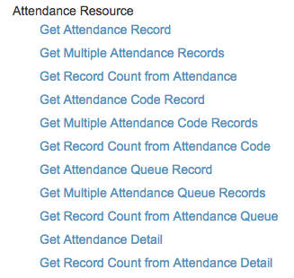
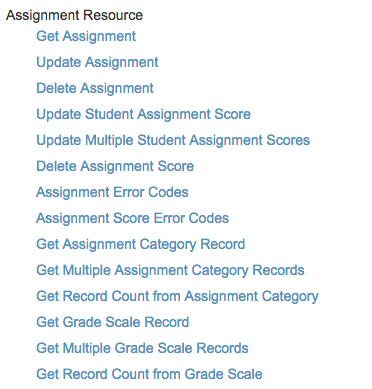
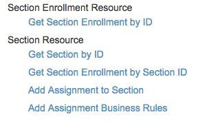

ETL is a project that consumes the Powerschool API to inject into the scholarscore
MariaDB/MySQL database. 

ETL is broken down into the three obvious components:

1.) Extract into the model provided via Powerschool using JSON -> Java Objects using Gson
2.) Emit the IApiModel<T> implementation via either a collection ITransformCollection<T>
    or via ITransform<T> where T in both cases extends from IApiModel<X>
3.) Load into the API server via a Java client of the API server in scholarscore

Documentation on the API from PowerSchool is located in the documentation directory

#PowerSchool API idiosyncrasies

Certain API endpoints are roughly RESTful, others require using this ad-hoc direct query API.  To use this  API, we need to explicitly declare every field we will be accessing within our PowerSchool `plugin.xml`:

    https://support.powerschool.com/developer/api/authentication/access_request.html

With this table-level API, we can query for records and use an ad-hoc query language supported by the PowerSchool API. There is documentation for this in the PowerSchool API developer guide that is located in `./doc/api-developer-guide-1.6.0.zip` in this module:

    file:///Users/markroper/Downloads/api-developer-guide-1.6.0/data-access/basic-read-and-write/usage.html#searching

##Attendance
There are a few Attendance related tables in powerschool, Attendance, DailyAttendance
For example, a query to return attendance records, 3 per page, page number two, all columns on or after Oct. 18 2015 would be:

    https://excelacademy.powerschool.com/ws/schema/table/attendance?q=Att_Date=ge=2015-10-18&pagesize=3&page=2&projection=*
PowerSchool offers an extension query for Attendance with some extra fields joined in, of the form:

    POST /ws/schema/query/com.pearson.core.attendance.student_attendance_detail?page={page}&pagesize={pagesize}
    
    file:///Users/markroper/Downloads/api-developer-guide-1.6.0/data-access/basic-read-and-write/resources.html#get_attendance_detail
The supported endpoints to the attendance API are:

##Assignment
There are multiple supported API endpoints for manipulating the assignment table. **TODO:** It is clearly possible to update a student score on an assignment from the doc below but less clear how to retrieve a student score on an assignment.

Database tables:

**PGScores** - The actual students assignment scores in PowerGrade much like SectionScores but a record per assignment instead of all in a BLOB field.

**PGAssignments**

##Section
The supported section API endpoints are below. To Extract all sections, we can use the following endpoint:
    `https://excelacademy.powerschool.com/ws/schema/table/sections?projection=Section_Number,Section_Type,TermID,SchoolID,Room,GradeScaleID,ID,ExcludeFromGPA,LastAttUpdate`

To Extract sections by school we can use:
    `GET /ws/v1/school/{school_id}/section?expansions={expansion_elements}&page={page_number}&pagesize={page_size}&q={query_expression}`
    
**TODO:** We have not yet determined if the grade formula appears on the section.

Database tables:

**ScheduleCC** - This is the scheduler version of the CC (current curriculum) table, which holds information about student section enrollments

**SPEnrollments** - Tracks students enrolled in special programs.

##Term
We can extract terms by school at:

    `GET /ws/v1/school/{school_id}/term?page={page_number}&pagesize={page_size}&q={query_expression}`
    
##Grades & GradeFormulas
Potential tables to source this from:

**DM_CurrentGrade** - Data Mart table containing references to Current Grade records. This table is refreshed with data nightly from the PowerSchool core tables related to current grades. Table is used by ReportWorks as a source when creating current grades reports.

**DM_StandardGrade** - Data Mart table containing references to Standard Grade records. This table is refreshed with data nightly from the PowerSchool core tables related to standard grades. Table is used by ReportWorks as a source when creating standard grades reports.

**GradeScaleItem** - The actual grades contained by the grade scales.
GradeScaleID (ver3.6.1) Number(10,0) The parent ID of this grade scale. If -1 then this is the parent otherwise this could be the general grade scale, such as Weighted GPA, Total GPA. Indexed.

**PGGradeScales** - Centralize classes' grade scales from PowerGrade.

**PGAssignments** - This assignments table has a weights column, the documentation for which indicates that:
Weight (ver3.6.1) Float The overall weight of this assignment. This multiplied by PointsPossible shows the actual points of this assignment for total possible points for this section.

##Other Interesting tables
**ClassRank**

**StandardsCurrent** - Snap shot of how students are doing in recorded standards

**StandardsGrades** - The standard scores students have if PowerGrade is not being used. This must be set up for each school first so Teachers can enter the Final Grades.

**StudentCoreFields** - Database extension table associated to the Students table, which has been migrated from PowerSchool custom fields. These fields store general information. Note: Columns in this table were previously custom fields.

**StudentTest**

**StudentTestScore**