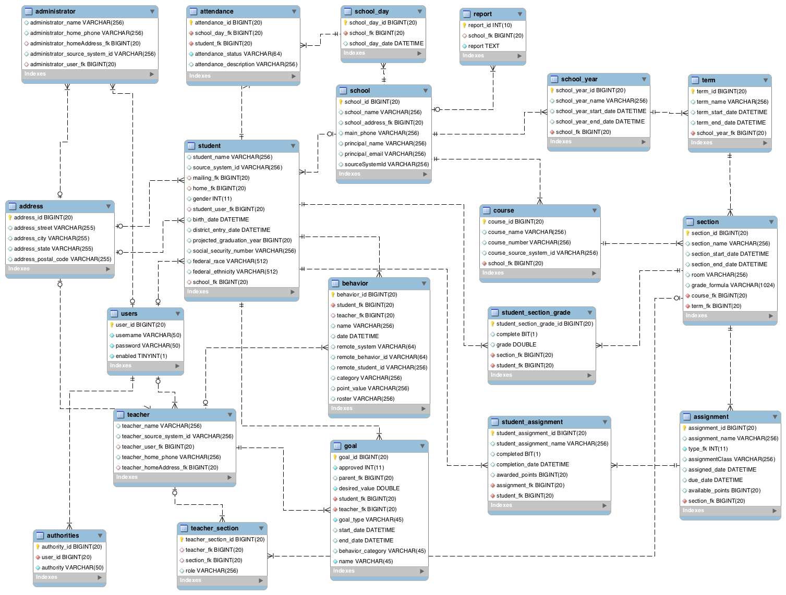

Scholar Score 
================
Scholar Score is a data warehouse application that exposes a REST API for CRUD operations on school districts, schools, grade levels, courses, assignments, teachers, students, student assignments and student courses. The platform is a multi-module application with a data warehouse, an analytics and visualization engine, and an ETL component used to populate the Warehouse with data from other systems.

The data warehouse component of the platform exposes a REST API. Functionality related to the data warehouse and its API reside in the **warehouse** module.

The platform will also have a data analytics and visualization engine that will consume data from the **warehouse** API related to student, teacher, school, and district performance and allow users to visualize that data in a a UI.  This module is not yet written, but expect to see an **analytics** module.

Domain objects and utility functionality are in the **common** module.  Other modules may have a compile dependency on the common project, for example the **warehouse** module, but the **common** module should have no dependencies on any other module.

Setting up the project
================
To run the project you'll need to install the following on the development machine:

    * Java8
    * Gradle
    * MySql version 5.6 (Newer versions may also run)
    * Git
    * An IDE (recommend Intellij or Eclipse)
    
Once these dependencies are resolved, you'll need to create the database user needed to support the API persistence:

`CREATE DATABASE scholar_warehouse;`

`CREATE USER 'warehouse'@'localhost' IDENTIFIED BY 't3achTh3Childr3n';`

`GRANT USAGE ON *.* TO 'warehouse'@'localhost';`

`GRANT ALL PRIVILEGES ON scholar_warehouse.* TO 'warehouse'@'localhost';`

After this the the following gradle command to bootstrap the database (creating all the tables and relationships between those tables) `gradle refillDatabase`. Then you can import the project in your IDE and start working.  When you want to deploy to the local container, run the gradle command `gradle appRun` or if you want to attach your IDE debugger run `gradle appRunDebug` and then attach the debugger once the command has deployed to the container.

If you want to run the UI or access some of the API endpoints with some dummy data, you can generate synthetic data on your instance by running the following Gradle task `./warehouse/gradle syntheticDataGen`.  This task takes about 25 minutes to run, but populates the instance with a school, school years, terms, courses, sections, teachers, students, student section grades, and student assignment grades.

Database Entity Relationship Diagram
================
